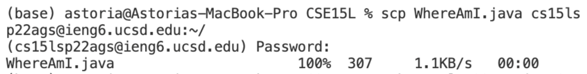
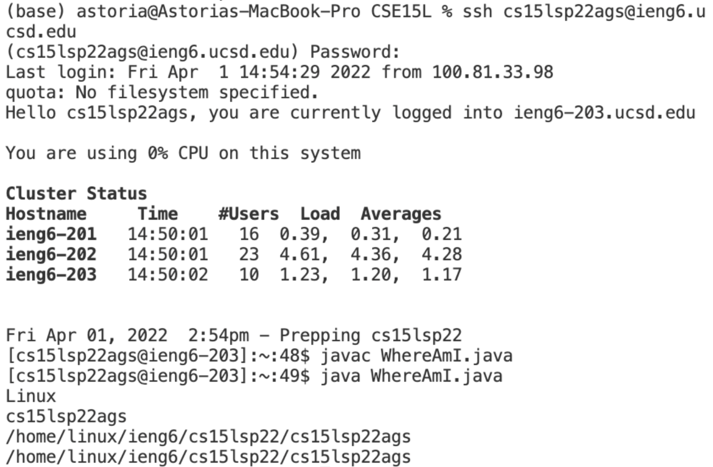
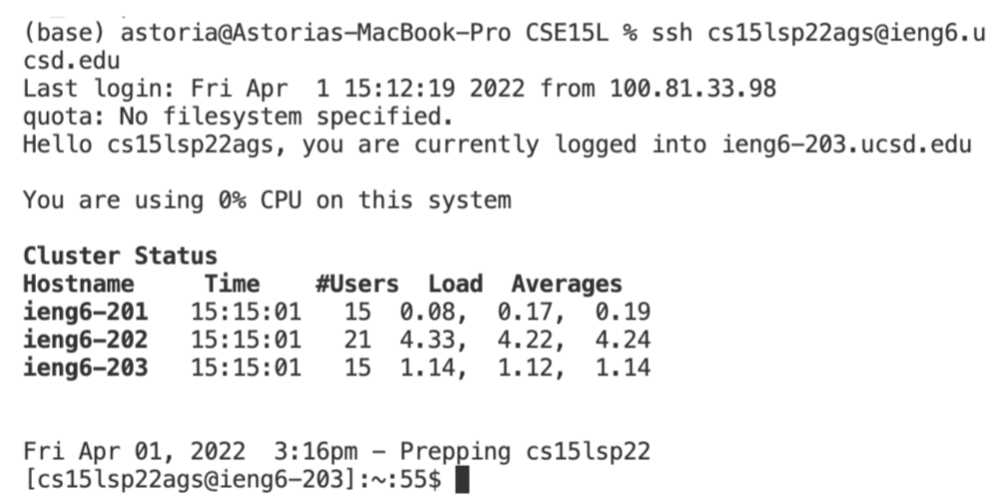

## Week 2 Lab Report
A totorial for incoming 15L students, or future me, about how to log into a course-specific account on `ieng6`.
1. Installing VScode

    * Download install package [for Mac](https://code.visualstudio.com/sha/download?build=stable&os=darwin-universal) or [for Windows](https://code.visualstudio.com/sha/download?build=stable&os=win32-user).
    What you should get:
     
    * install OpenSSH, following [instructions](https://docs.microsoft.com/en-us/windows-server/administration/openssh/openssh_install_firstuse).<br>

2. Remotely Connecting

    * Open terminal
    * enter command `ssh cs15lsp22__@ieng6.ucsd.edu`, put your identical characters on the underline.
    * Then they should ask you for your password, enter your password.
    * After aforementioned process, you should get: 
   

3. Trying Some Commands

    | Commands  | Description |
    | :----:      | :---      |
    | mkdir | Make directory     |
    | pwd | Print work directory     |
    | cd   | Change directory       |
    | \~  | represents `home` directory       |
    | ls  | List files        |
    | ls -l   | List files, inlong listing format        |
    | ls -a  | List files, including files starting with dot `.`       |
    | ls -t | List files, with time   |
    | cat | concatenate, output file content |
    | exit | logout |

    An example of trying commands: 
 

4. Moving Files with scp
    * use command `scp ______.java cs15lsp22___@ieng6.ucsd.edu:~/`.
    This command means **securely copying files** of file to a certain location.
    * Try runing the files on different locations:
        * on local
 
        * on server
         

    
5. Setting an SSH Key
    * On your local computer, enter command     `ssh-keygen`  
    * WHat your should see:
    ```
    $ ssh-keygen
    Generating public/private rsa key pair.
    Enter file in which to save the key (/Users/<user-name>/.ssh/id_rsa): /Users/<user-name>/.ssh/id_rsa
    Enter passphrase (empty for no passphrase): 
    ```
    **Do not add a passphrase for this step! (press enter)**
    ```
    Enter same passphrase again: 
    ```
    **Press enter for this step**
    
    ```
    Your identification has been saved in /Users/<user-name>/.ssh/id_rsa.
    Your public key has been saved in /Users/<user-name>/.ssh/id_rsa.pub.
    The key fingerprint is:
    SHA256:jZaZH6fI8E2I1D35hnvGeBePQ4ELOf2Ge+G0XknoXp0 <user-name>@<system>.local
    The key's randomart image is:
    +---[RSA 3072]----+
    |                 |
    |       . . + .   |
    |      . . B o .  |
    |     . . B * +.. |
    |      o S = *.B. |
    |       = = O.*.*+|
    |        + * *.BE+|
    |           +.+.o |
    |             ..  |
    +----[SHA256]-----+

    ```
    * Windows users should follow more step [here](https://docs.microsoft.com/en-us/windows-server/administration/openssh/openssh_keymanagement#user-key-generation)
    * Copy the public key to the .ssh directory of your user account on the server: `ssh cs15lsp22__@ieng6.ucsd.edu`, then enter your password.
    * Now you should be able to log in freely: 

6. Optimizing Remote Running
    
    Try to put numerous commands in one line!
    * Using quotes `""`
        * `$ ssh cs15lsp22zz@ieng6.ucsd.edu "ls"`
    * Using semicolons `;`
        * `$ cp WhereAmI.java OtherMain.java; javac OtherMain.java; java WhereAmI`

