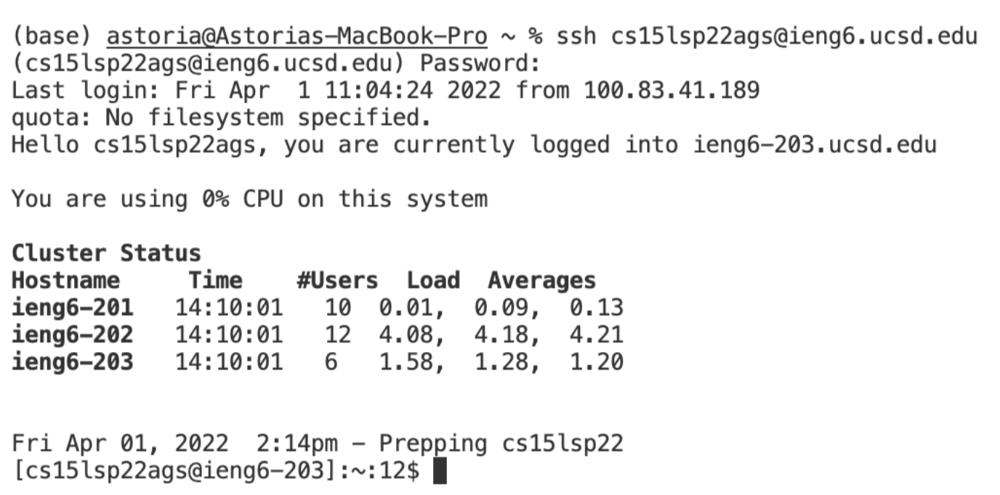

## Week 2 Lab Report
A totorial for incoming 15L students, or future me, about how to log into a course-specific account on `ieng6`.
1. Installing VScode

    * Download install package [for Mac](https://code.visualstudio.com/sha/download?build=stable&os=darwin-universal) or [for Windows](https://code.visualstudio.com/sha/download?build=stable&os=win32-user).
    What you should get:
     
    * install OpenSSH, following [instructions](https://docs.microsoft.com/en-us/windows-server/administration/openssh/openssh_install_firstuse). 
 
2. Remotely Connecting
    * open terminal
    * enter command `ssh cs15lsp22__@ieng6.ucsd.edu`, where put your identical characters on the underline.
    * Then they should ask you for your password, enter your password.
    * After aforementioned process, you should get:  

3. Trying Some Commands
4. Moving Files with scp
5. Setting an SSH Key
6. Optimizing Remote Running

