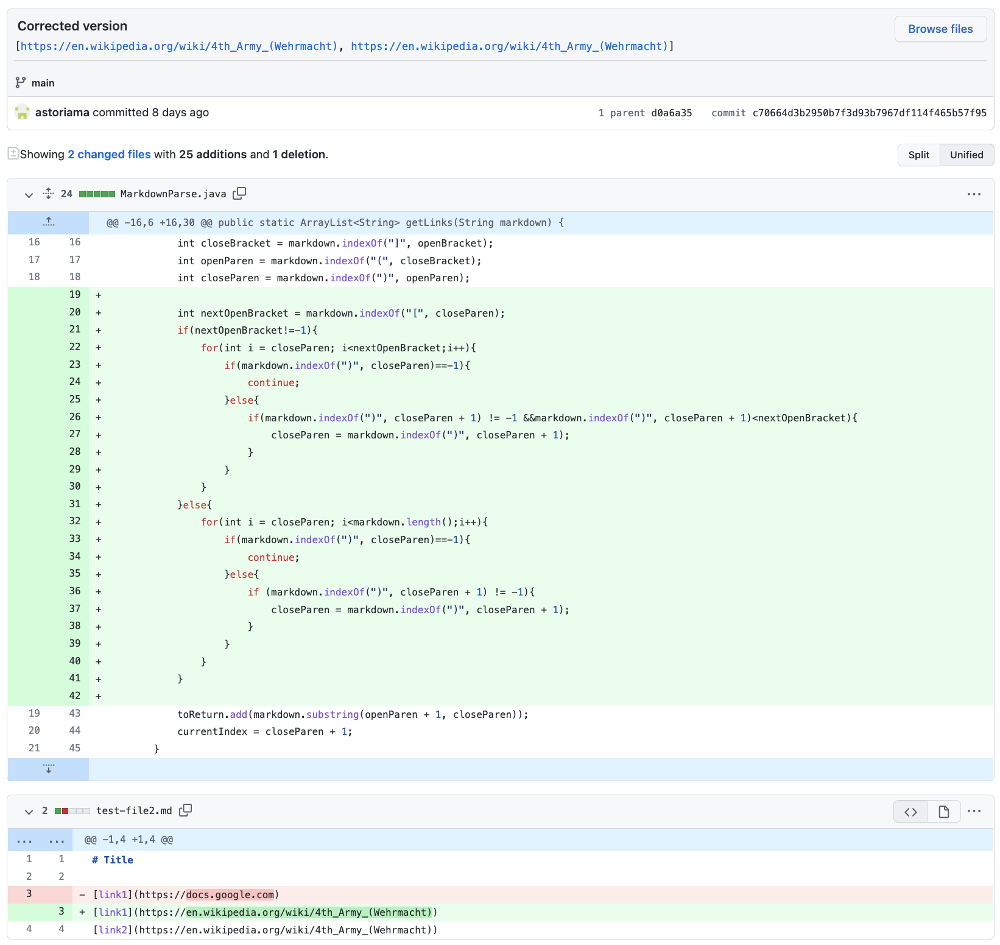
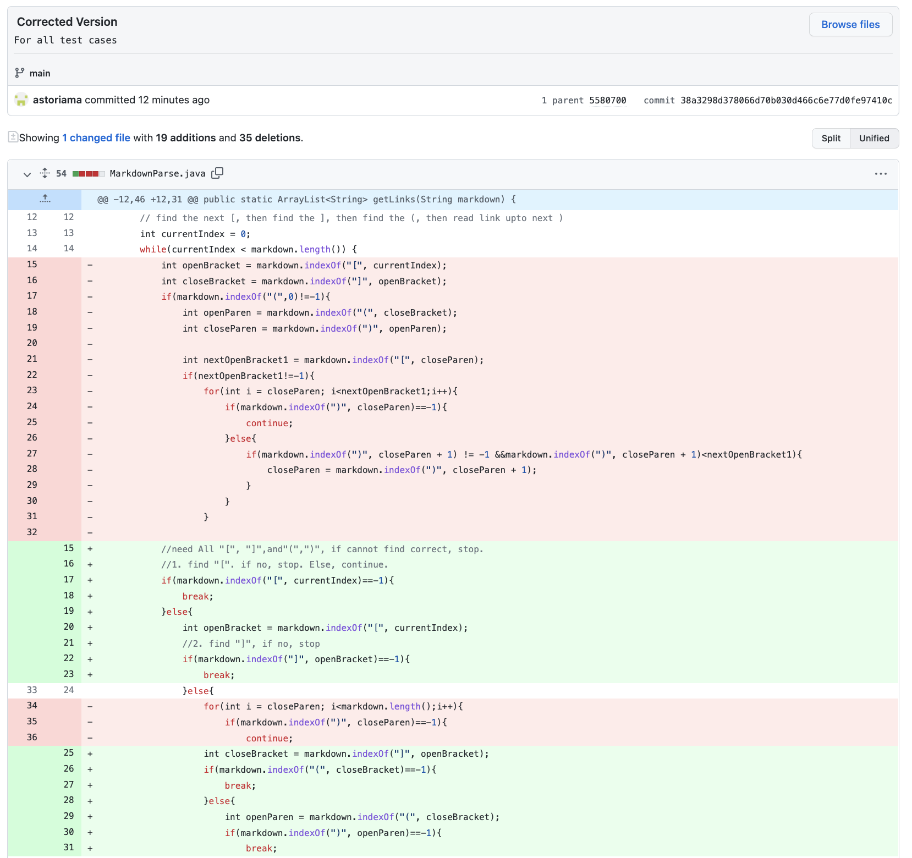
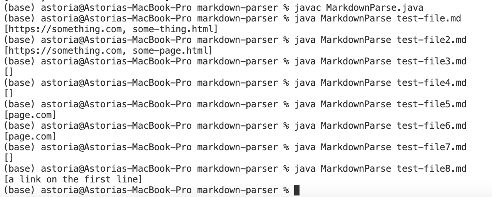
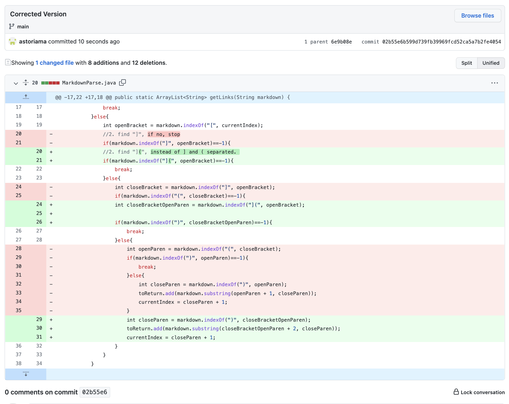

# Lab Report 2 Week 4
### 3 changes to MarkDownParse.java
---
## First Correction: Allow paratheses in links
 

Link to the test file for a failure-inducing input that prompted you to make this change is [here](https://github.com/astoriama/markdown-parser/commit/d0a6a357b7a569e9424167a06e03bda0c65eb455).

An unexpected output in shown as:
```
Exception in thread "main" java.lang.OutOfMemoryError: Java heap space
        at java.base/java.util.Arrays.copyOfRange(Arrays.java:3822)
        at java.base/java.lang.StringLatin1.newString(StringLatin1.java:769)
        at java.base/java.lang.String.substring(String.java:2709)
        at MarkdownParse.getLinks(MarkdownParse.java:19)
        at MarkdownParse.main(MarkdownParse.java:30)
```

The failure is caused by extra paratheses in the link in the file. The original code take in the first closing paratheses it sees and make mistake because it can not find the next correct symbol. However, I altered the code so that it use the last paratheses it sees, which will lead it to its' correct way.


## Second Correction: Allow blank space around code
 
 

Link to the test file for a failure-inducing input that prompted you to make this change is [here](https://github.com/astoriama/markdown-parser/commit/faa8431f04f6e5f6b86c51881fa1e35b2cb7ac09).

The unexpected output in shown as:
```
(base) astoria@Astorias-MacBook-Pro markdown-parser % javac MarkdownParse.java
(base) astoria@Astorias-MacBook-Pro markdown-parser % java MarkdownParse test-file.md
Exception in thread "main" java.lang.OutOfMemoryError: Java heap space
        at java.base/java.util.Arrays.copyOf(Arrays.java:3512)
        at java.base/java.util.Arrays.copyOf(Arrays.java:3481)
        at java.base/java.util.ArrayList.grow(ArrayList.java:237)
        at java.base/java.util.ArrayList.grow(ArrayList.java:244)
        at java.base/java.util.ArrayList.add(ArrayList.java:454)
        at java.base/java.util.ArrayList.add(ArrayList.java:467)
        at MarkdownParse.getLinks(MarkdownParse.java:43)
        at MarkdownParse.main(MarkdownParse.java:58)
```
The major issue of all test cases are there are extra element in the file besides the link, or the format of link is not correct. To fix the problem, we only need to check every part of the link's format, stop when anything goes wrong, and print whatever is inside two paratheseses. The failure is because the code went into an infinite loop by searching for something that does not exist, we only need to stop when there are nothing to look for. So I inputed many if-statements and breaking commands.

Corrected Output:
 

## Third Correction: Allow brackets in link discription
 

Link to the test file for a failure-inducing input that prompted you to make this change is [here](https://github.com/astoriama/markdown-parser/commit/6e9b08eba085109f2ffdbadc5075d8ded5b3a2c5).

While the output should be: `[hi.com,hi.com]`, the extual output is:
```
(base) astoria@Astorias-MacBook-Pro markdown-parser % javac MarkdownParse.java
(base) astoria@Astorias-MacBook-Pro markdown-parser % java MarkdownParse test-file3.md
[hi, hi.com]
```
The mistake in the output is caused by the extra brackets in the description part. What I did is simply combines open paratheses and close brack into a search for `](`. Using this strategy, only correct versions of link could be scanned.👍


