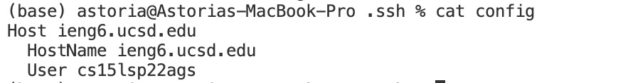
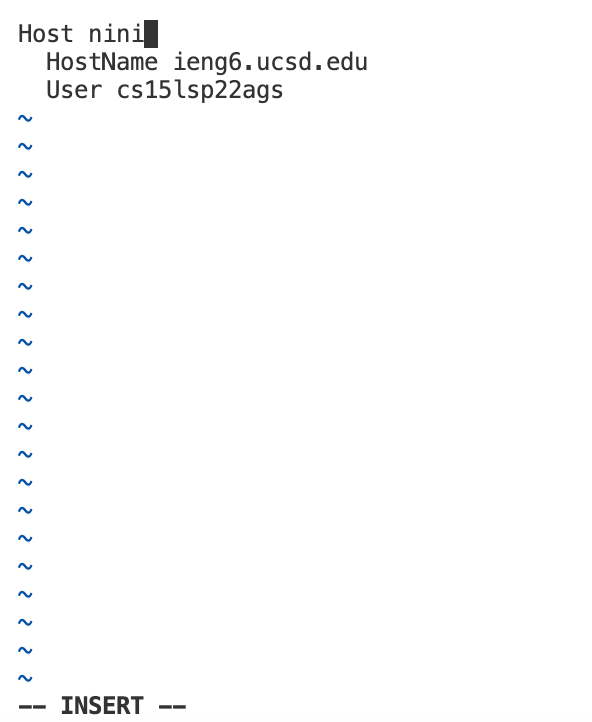
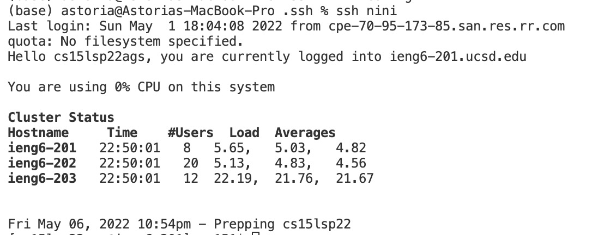
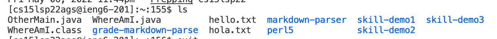
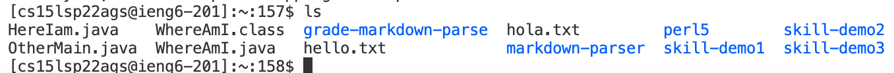
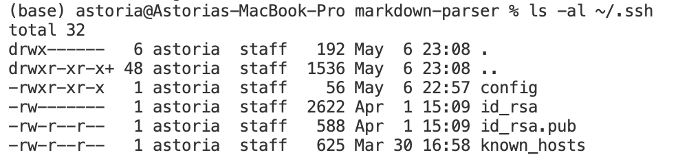
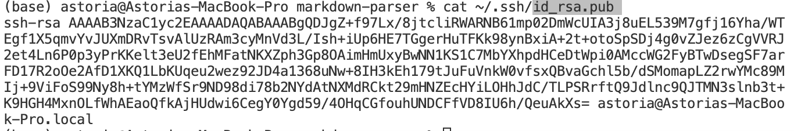
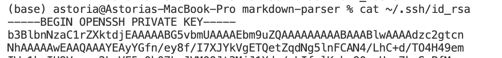
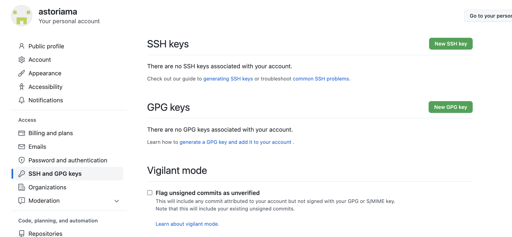

# Lab report 3
## Streamlining ssh Configuration
### Showing and editing my .ssh/config file
I accessed my `.ssh/config` file by using:
```
% cd ~ .\ssh
% cat config
```
Which gives:
 

I edited the file using:
```
% chmod +x config
% vim config
```
Which opens up the file in my terminal for me to edit, then I pressed `i` to enter insert mode. Where I changed my original host name to my alias `nini`:
 


### Show the ssh command logging you into your account using just the alias you chose:
Since I chose `nini` as my alias I used command:
```
$ SSH nini
```
 


### Show an scp command copying a file to your account using just the alias you chose.
I created a file named HereIam.java, then:
```
(base) astoria@Astorias-MacBook-Pro markdown-parser % scp HereIam.java nini:~/
HereIam.java                                                  100%  303    12.5KB/s   00:00  
```
Comparing the list of files before and after the command, we can see the file has been successfully copied:
Before:
 

After:
 

## Setup Github Access from ieng6

### Public key and private key
Public key on my user account is stored in id_rsa.pub file in .ssh directory, while private key is stored in id_rsa file:
 

As I open id_rsa.pub file, I get my public key:
 

As I open id_rsa file, I get my private key (content not included):
 

Keys on github is stored in setting:
 

