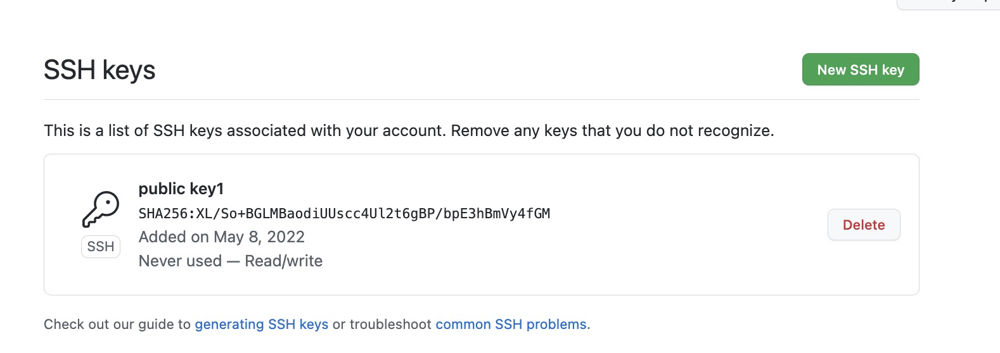
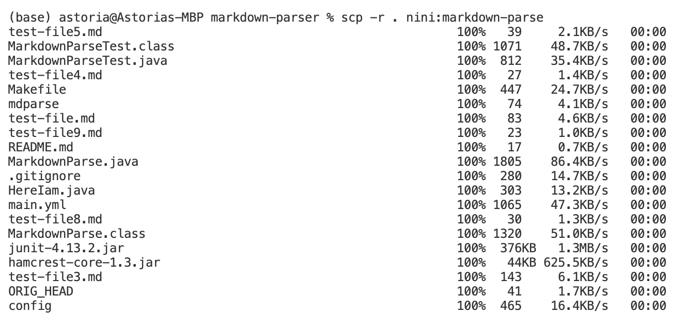
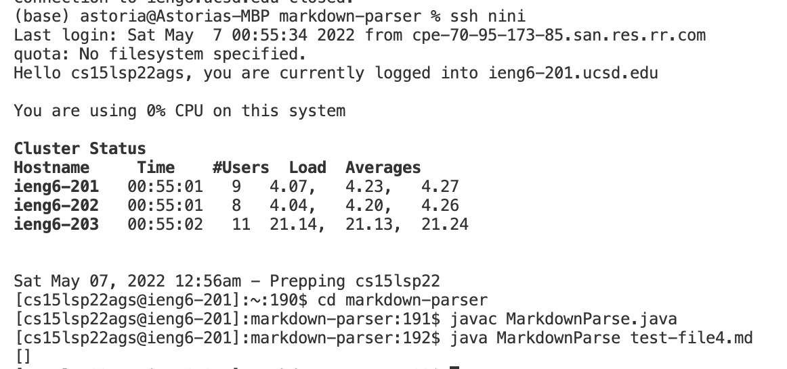
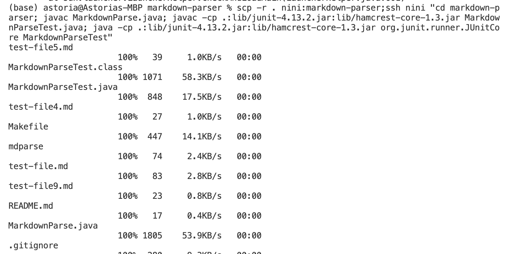

# Lab report 3
## Streamlining ssh Configuration
### Showing and editing my .ssh/config file
- I accessed my `.ssh/config` file by using:
```
% cd ~ .\ssh
% cat config
```
- Which gives:
 

- I edited the file using:
```
% chmod +x config
% vim config
```
- Which opens up the file in my terminal for me to edit, then I pressed `i` to enter insert mode. Where I changed my original host name to my alias `nini`:
 


### Show the ssh command logging you into your account using just the alias you chose:

- Since I chose `nini` as my alias I used command
`$ SSH nini`:

 


### Show an scp command copying a file to your account using just the alias you chose.

- I created a file named HereIam.java, then:
```
(base) astoria@Astorias-MacBook-Pro markdown-parser % scp HereIam.java nini:~/
HereIam.java                                                  100%  303    12.5KB/s   00:00  
```
- Comparing the list of files before and after the command, we can see the file has been successfully copied:
     - Before:
 

     - After:
 

## Setup Github Access from ieng6

### Public key and private key
- Public key on my user account is stored in id_rsa.pub file in .ssh directory, while private key is stored in id_rsa file:
 

- As I open id_rsa.pub file, I get my public key:
 

- As I open id_rsa file, I get my private key (content not included):
 

- Public Key on github is stored in setting:

 

## Running git commands to commit and push a change to Github while logged into your ieng6 account:
- I modified my `MarkdownParseTest.java` file and commited my change:
 

- Then, I pushed:
 

- A link to my commit is [here](https://github.com/astoriama/markdown-parser/commit/e62f94fa4cf0a7cbd3102f8f9bed7c6b896809fa).

## Copy whole directories
- Using `scp -r` I copied all my files recursively into my user account:
 

- Running file on server:
 

- Combination of commands:
 

