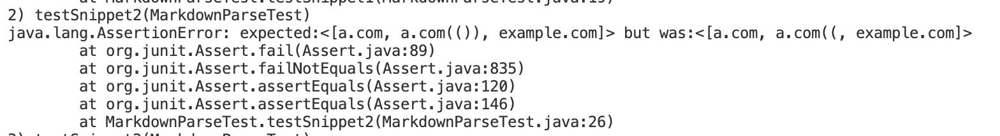
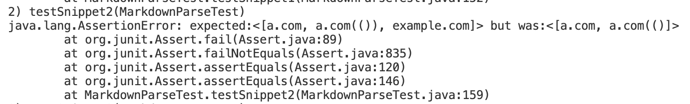

# Lab report 4
## Required links
- [My Markdown-parser repository](https://github.com/astoriama/markdownParse-for-report4.git)
- [Reviewed Markdown-parser repository](https://github.com/ima-quack/markdown-parser.git)

## Snippet 1
### Expected Product:

### Code in `MarkdownParseTest.java`:

## Testing and fixing my implementation:

My code failed due to the reason that I never considered such quotation marks' priority as in the first link. I believe I could fix the code by adding an if statement at the begining, to determine whether their exists such quotation marks. If such quotation exists, than prioritize such quotation mark.
## Testing other's implementation:

## Snippet 2
### Expected Product:

### Code in `MarkdownParseTest.java`:

## Testing and fixing my implementation:

This failure is because I failed to consider the possibility of having two closing paranthesises in the link. However, I do not think I can fix such issue in short lines. I had tried multiply times in previous labs, and failed.
## Testing other's implementation:

## Snippet 3
### Expected Product:

### Code in `MarkdownParseTest.java`:

## Testing and fixing my implementation:

This failure is due to lack of consideration of blankspace. In order to fix such issue, we just need to let the `currentIndex` add one when it meet blanksapce, to skip blankspace and restore correct format.
## Testing other's implementation:

