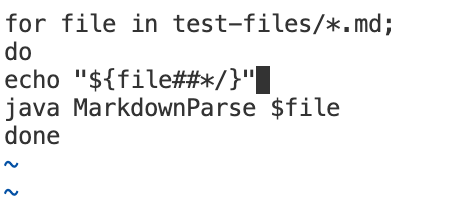
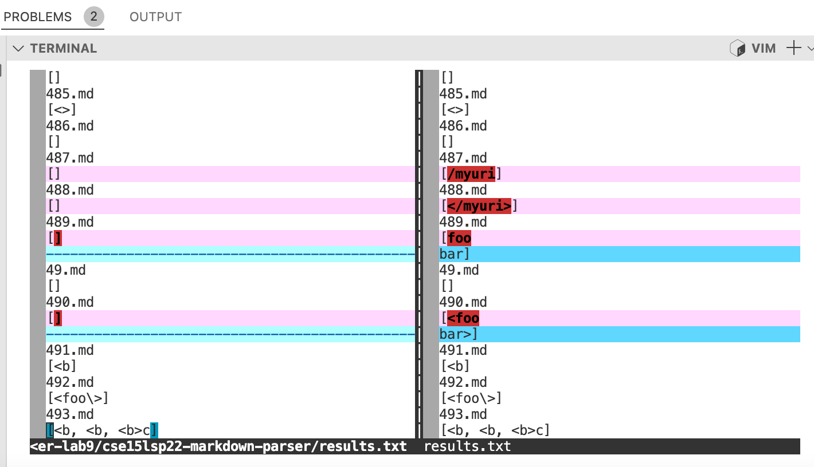
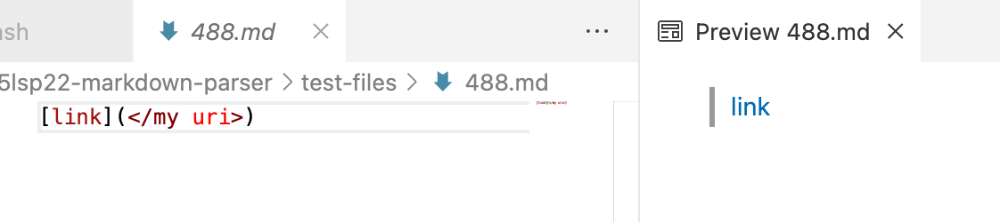
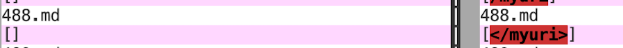
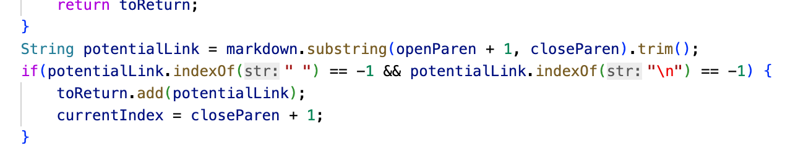
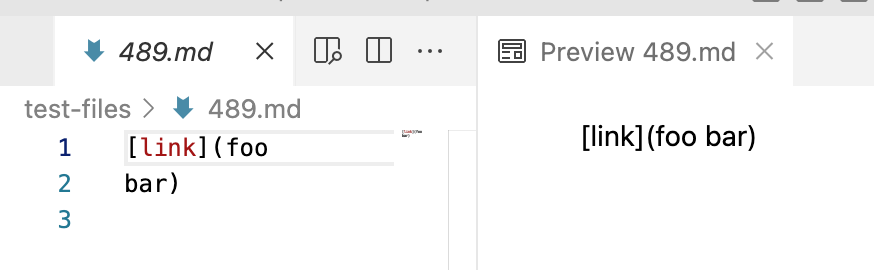
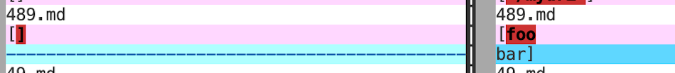

# Week 10 Lab Report 5
## Compare different results
- Fist, I used `vim script.sh` to open `script.sh` and added a command for printing file names:

- Then I runned `bash script.sh > results.txt` in both repositories.
- After I got the two txt files, I used `vimdiff /Users/astoria/Documents/GitHub/skill-demo/markdown-parser-for-reports/results.txt /Users/astoria/Documents/GitHub/markdown-parser-lab9/cse15lsp22-markdown-parser/results.txt` to get the comparison result of txts:

In this report, I am going to discuss test file 488 and 489.

## test-file 488
- This is the [link](https://github.com/astoriama/markdownParse-for-reports/blob/main/test-files/488.md) to the test file
- As shown in preview, the correct link for test-file 488 should be '</my uri>':

- The given implementation is wrong, while my implementation is correct:

- The reason that given implementation can not recognize such link is it's code does not tolerant blank space in links:

To recognize such link, we only need to delete the if statement.

## test-file 489
- This is the [link](https://github.com/astoriama/markdownParse-for-reports/blob/main/test-files/489.md) to the test file
- As shown in preview, the correct link for test-file 489 should be `[]`:

- The given implementation is correct, while my implementation is wrong:

- The problem with my code is that I allowed changed in line in text. What I should change about my code is add an if statement about `/n` which indicates the line changing command. If `\n` exists, than the link should not be added to output.
